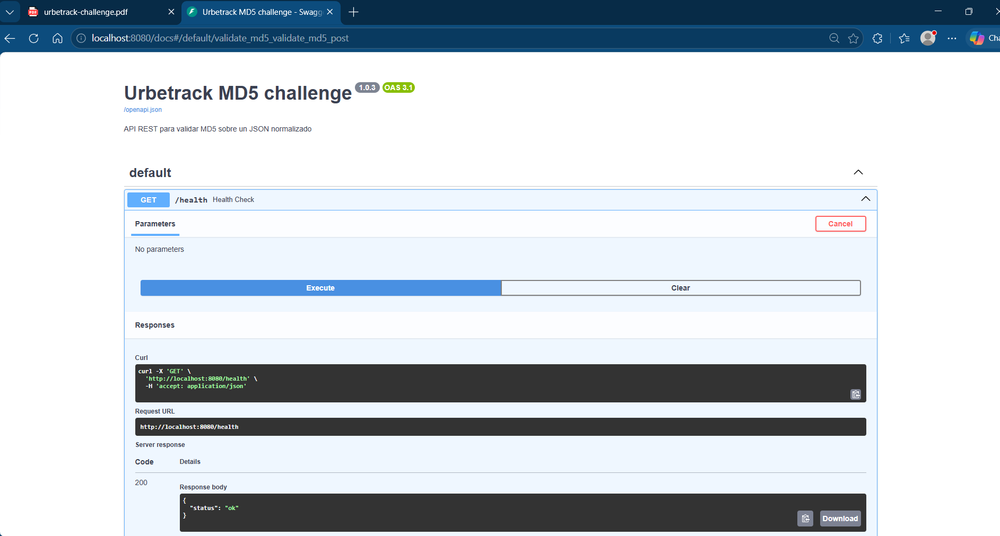
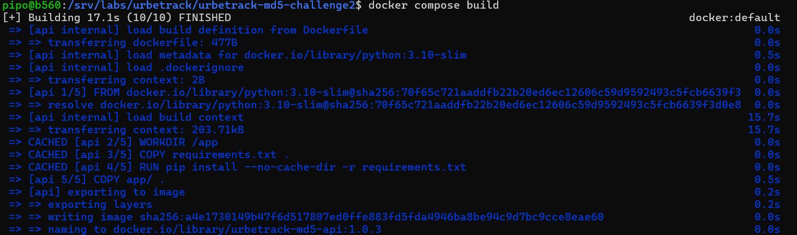

# Urbetrack MD5 Challenge

## Overview

This project implements a REST API that validates whether a JSON payload matches a provided MD5 hash.

The solution was developed as a DevOps/SRE technical challenge and focuses on:

- REST API implementation with FastAPI.
- Automatic Swagger/OpenAPI documentation.
- Dockerized application.
- Nginx reverse proxy.
- Docker Compose orchestration.
- Bash scripts for build, start, stop and healthcheck.
- GitHub Actions workflow to validate build and runtime behavior.

## Architecture

```text
Client
   |
   v
 Nginx Reverse Proxy - http://localhost:8080
                 |
                 v
              FastAPI Application - internal port 8000
```


### Screenshots

<p align="center">
  
  
  
  
</p>


### Components

| Component                 | Purpose                                                                 |
|---------------------------|-------------------------------------------------------------------------|
| FastAPI                   | Exposes the REST API and generates Swagger/OpenAPI documentation.       |
| Gunicorn + Uvicorn Worker | Runs the ASGI application inside the container.                         |
| Nginx                     | Acts as reverse proxy in front of the API.                              |
| Docker Compose            | Builds and runs the API and Nginx containers.                           |
| GitHub Actions            | Builds the project and validates that the environment starts correctly. |

## Requirements

- Git
- Docker
- Docker Compose

## Repository clone

```bash
git clone https://github.com/PF-dev0ps/urbetrack-md5-challenge.git
cd urbetrack-md5-challenge
```

## Start the environment

```bash
./scripts/start.sh
```
```

After starting the environment, the API is available through Nginx at:

```text
http://localhost:8080
```

## Stop the environment

```bash
./scripts/stop.sh
```

## Healthcheck

The `/health` endpoint validates service availability.

```bash
curl http://localhost:8080/health
```

Expected response:

```json
{
  "status": "ok"
}
```

A Bash healthcheck script is also included. It checks `/health` every 5 seconds:

```bash
./scripts/healthcheck.sh
```

## Swagger / OpenAPI documentation

FastAPI exposes the interactive API documentation at:

```text
http://localhost:8080/docs
```

## API endpoint

### POST `/validate-md5`

Receives a JSON payload and an expected MD5 hash. The API normalizes the JSON payload, calculates its MD5 hash and compares it against the value received in the request.

Request body:

```json
{
  "payload": {
    "empresa": "UrbeTrack",
    "name": "Paulo"
  },
  "md5": "8ddf45693d4185b95732d263fade0be2"
}
```

## Valid request example

```bash
curl -X POST http://localhost:8080/validate-md5 \
  -H "Content-Type: application/json" \
  -d '{
    "payload": {
      "empresa": "UrbeTrack",
      "name": "Paulo"
    },
    "md5": "8ddf45693d4185b95732d263fade0be2"
  }'
```

Expected response:

```json
{
  "Valido": true,
  "MD5": "8ddf45693d4185b95732d263fade0be2"
}
```

## Invalid request example

```bash
curl -X POST http://localhost:8080/validate-md5 \
  -H "Content-Type: application/json" \
  -d '{
    "payload": {
      "empresa": "UrbeTrack",
      "name": "Paulo"
    },
    "md5": "487dd71db6ca994eafa617b7911406ae"
  }'
```

Expected response:

```json
{
  "Valido": false,
  "MD5": "8ddf45693d4185b95732d263fade0be2"
}
```

## MD5 calculation

The MD5 is calculated from the full `payload` object after normalizing the JSON.

The normalization uses:

- `sort_keys=True` to make the key order deterministic.
- `separators=(",", ":")` to remove unnecessary spaces.
- UTF-8 encoding before calculating the MD5.


For this payload:

```json
{
  "empresa": "UrbeTrack",
  "name": "Paulo"
}
```

The normalized JSON is:

```json
{"empresa":"UrbeTrack","name":"Paulo"}
```

The resulting MD5 is:

```text
8ddf45693d4185b95732d263fade0be2
```

## Technical decisions

- **FastAPI** was selected because it provides a simple way to expose REST endpoints and automatically generate Swagger/OpenAPI documentation.
- **JSON normalization** was used to avoid different MD5 results caused only by field ordering or whitespace differences.
- **Docker** was used to make the execution environment reproducible.
- **Nginx** was included as a reverse proxy to represent a more realistic deployment pattern.
- **Docker Compose** was used to run the API and reverse proxy together.
- **Gunicorn with Uvicorn workers** was used instead of the development server for a more production-like runtime.
- **GitHub Actions** validates that the image can be built, Docker Compose is valid, the environment starts and the healthcheck responds correctly.

## GitHub Actions workflow

The CI workflow validates the following:

- Repository checkout.
- Docker build.
- Docker Compose configuration validation.
- Environment startup.
- Real healthcheck against `/health`.
- Basic test request against the MD5 validation endpoint.
- Environment cleanup with `docker compose down`.

## Assumptions

- The MD5 is calculated only from the `payload` field, not from the complete request body.
- The JSON payload is normalized before calculating the hash.
- The API receives the expected MD5 in the request body.
- The service is exposed locally through Nginx on port `8080`.
- The challenge is focused on technical reasoning and DevOps/SRE practices, not on cryptographic security.

## Limitations and risks

- MD5 is not considered secure for cryptographic use cases.
- The current API returns HTTP 200 with `Valido: false` when the MD5 does not match. A stricter implementation could return an HTTP error such as `400 Bad Request` or `422 Unprocessable Entity`.
- The current validation is functional but minimal.
- There is no authentication or authorization.
- There is no rate limiting.
- There are no custom request size limits.
- Logs are written to standard output but are not centralized.
- Metrics and alerting are not implemented.
- Secrets are not required for the current MD5 validation flow.

## What I would improve for production

If this service had to run in production, I would adjust the following areas:

### Deployment

Use an automated CI/CD pipeline with separated stages for build, test, security checks and deployment. Deployments should be environment-based, for example: development, staging and production.

### Rollback

Use immutable image tags and keep previous stable versions available. A rollback could be performed by redeploying the last known-good image tag.

### Logs

Keep application and access logs in standard output and collect them with a centralized logging platform such as Loki.

### Metrics

Expose application and infrastructure metrics, including request count, latency, error rate and container resource usage.

### Alerts

Define alerts for failed healthchecks, high error rate, high latency, container restarts and resource saturation.

### Secrets

Although this challenge does not require secrets, production environments should manage secrets outside the source code using environment variables, Docker/Kubernetes secrets, Vault or a cloud secret manager.

### Scalability

Run multiple API replicas behind a load balancer or orchestrator. For Kubernetes, define readiness and liveness probes.

### Security

Add request validation, rate limiting, HTTPS termination, dependency scanning and container image scanning. Avoid running containers with unnecessary privileges.

### Registry

Push versioned images to a container registry such as Docker Hub, GitHub Container Registry, ECR or another private registry.

### Image versioning

Now is using semantic versions, but Git commit SHA tags or release tags so this is better.

Example:

```text
urbetrack-md5-api:1.0.3
urbetrack-md5-api:<git-sha>
```

### Resource limits

Define CPU and memory limits for containers to avoid uncontrolled resource usage.

Example production-oriented Compose/Kubernetes settings would include:

- CPU limit.
- Memory limit.
- Restart policy.
- Healthchecks.
- Readiness/liveness probes in Kubernetes.

