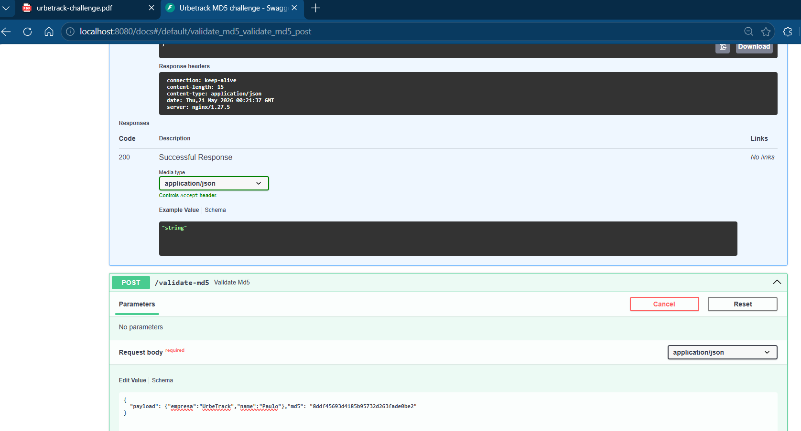
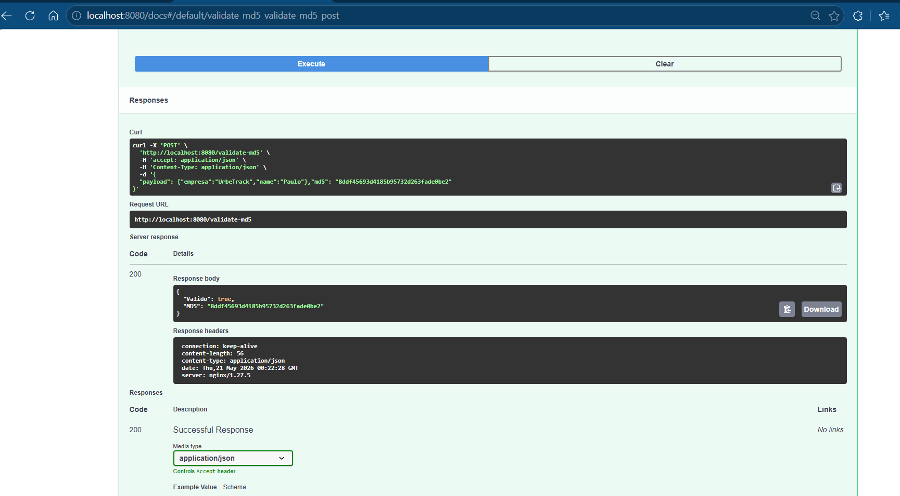

# Urbetrack MD5 Challenge**WORKING-PROGRESS

## Overview

This project implements a REST API to validate MD5 hashes generated from a JSON input.

The solution uses FastAPI and includes:

- REST API with Swagger/OpenAPI documentation
- Dockerized applicacion
- Nginx reverse proxy
- Docker Compose orquestration
- Bash scripts requested
- GitHub Actions CI workflow
- Check Health

This challenge is not only to provide a working API, it’s also for a demonstration of DevOps/SRE-oriented position.
---

# Architecture

Client
    |
    v
  Nginx Reverse Proxy
                   |
                   v
                FastAPI Application

Componentes:

- FastAPI handles the REST API and Swagger/OpenAPI generation.
- Nginx works as reverse proxy.
- Docker Compose orchestrates the containers.
- GitHub Actions validates itself, build and do the execution automatically.

##Screenshots

  
  
  

